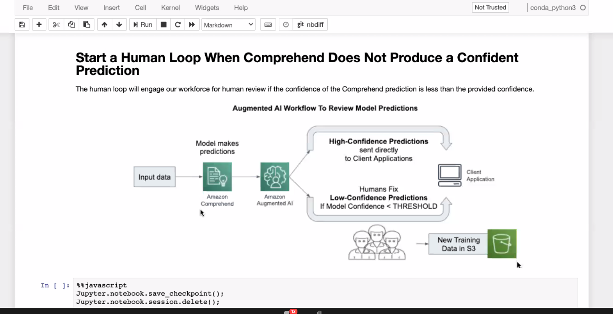

# Notes for workshop: [todo put name]

sending from germany, düsseldorf
- part of an upcoming o reilly book
data science on AWS, early 2012

## hosts:
- Antje Barth; Dev for machine learning for AWS- co founder of düsseldorf chapter of "Women in big data"
- Chris Fregly; second host; from SF (USA); moch smoke today ..

## important!
data-science-on-aws/workshop is the public repo (github)

add: 3_workshop_agenda.png

copied from slack:
"git at https://github.com/data-science-on-aws/workshop
GitHubGitHub
data-science-on-aws/workshop
AI and Machine Learning with Kubeflow, Amazon EKS, and SageMaker - data-science-on-aws/workshop
"

https://eventbox.dev/lesson/data-science-on-aws

Event: Workshop
Team Name: (Team Name Not Set Yet)
Event ID: 349034e8ab0c44158397eb7bd8befa34

Team ID: e4c1fde85cca4f1fbe3dddc9dcb08def

----------------

my cloned repo:
https://github.com/marcelpetrick/workshop

----------------

my console:
https://us-west-2.console.aws.amazon.com/console/home?region=us-west-2#

----------------
https://signin.aws.amazon.com/federation?Action=login&Issuer=localhost&Destination=https%3A%2F%2Fconsole.aws.amazon.com%2Fconsole%2Fhome%3Fregion%3Dus-west-2&SigninToken=r-doYOIUGbFW-oLrWW8RDaEwMsIRTBryRvw4goD1dYTKKBbLwe1MGlxTJbtjLhz6FTkk8sj2yNkO0ZJsgo2EyGDky4vUms_3JOUr97fYGSd_0CTyCQ5cnkJEoBQ8ldaFb7RBEpcmKtKp4AyQkv4UfIozM5C9W7lTC8XXaiPjwdCpqCwsHbYJQsOY0BjSp0FssaFAELZwA07ojImptwhHy70JzvBtn9eYpJ0NSf39RlVGw2LPaD_AD_FkX5-epWMgqaGENamOUJqyOtmqE7l0OeKOSHphYy8aE3RTrJ-BcJ9xn7bLlHPACYDEzEQEgxqP5KwJ_GfjNuWk8pSWW4bvqFe_p1fHLozfD1CJiBTm57IHmrjkQZ0Cmef9TNWFvdZ85czHUwJAVwVpGjs1JqmN5hzjVsYo57-i5gQ63ZbJtUkibgsbAS8a5B_BWRVJZQsq7tFBXisbx2L7HFbM5WXQAkZWiz1WS3eM1r8IqaEYccQozk0wpfJbPfNXRACAe8fDlXRw04oGTwz0BpGdQZy_sjIb6RMxSQo9d9fX2BbPMsFJGq9RODrEphMt0uW7x6oaHn1vdY7OADHwZd-9vlKOFbX0__-HM-GAz3_DBkVBBc2nXq1HbHVzXf8Tb7TFxFGZ7N_mchjW7atMermP8W5bf-A8If4ElsXerHAI2ItbpuGcZWH8eDJjtX5niAdOcMQJ2Ah9hUfolwCuMH-iw21eHQf3qE5OJvSwXrpj0EnPPueMtV-9wkZECRGt6aY7ENgzmVErc-zG7ai_bswKgUQZYN-EwnIYcObWRcWLZqekle3eQ_bbBypjkhRdkDjUJisDpg-pg0mGCvEjX9jIaikquY8YGicKThCrgU1fPGzNox3VdcRKdiatDY6bAL0hWlLWzR4Lwf7fCSxzTm_v64q5E4-wGnZqY5Ffe-ga_dC7jx6GJXbY5-YM7mn717UMbG-Rgs2qLilIxEg6EPBSFT4z7XunjM4f7BqYEAp31viL9_OHOc7iYkEPBMDCqBBFqFWk95HQdaRz7lC-v3BTPaRM6MqCjT08CXAh1Icmgz8GdE02R-DU1jSkwWnPcGn0SZtkK7VSUXhkMbfkqozibSH2ACs6NCMIVCpMSwx2yNiaKBPn9bvBozLD1MeQ4aXyUPvfXMh8BHdNZ-I0z9F9RQ_Xdzgz7uWdrZMS6v2Kc2UUIQb-gvJXpka4qXkXmazMROCg9q590kZ3uPPyfPa9FmznlxE7usfybyYWyMZMbc14N366XcyX_2RQDY7Y4gDSnmFTP2NMdi4YAOtQoawb9phl2jen4kUtNjnllc5nzNdkAthjJNFQ9Jo1QLuL1z_w1PinELZOmgqYGOjncvJXt_ZdwASVXLTOFOiwF76jjXsRb5DQFGNROnmnDVkBpMr0sxVMmXJ-tvN--46MZgnT9XxqN5CTZZZSKR1jkrWxmFeh31A

---------

teamrole should be visible in the to right
as well the "us west 2" (nothing else)

---------

1. create a AWS sagemaker instance
https://us-west-2.console.aws.amazon.com/sagemaker/home?region=us-west-2#/notebook-instances

create a new instance, notebook, not the studio
250 gb as volume size

---------
1-2 minutes until the instance is created
---------
"Success! Your notebook instance is being created.
Open the notebook instance when status is InService and open a template notebook to get started.
View details"
---------

* use "open jupyter" (not jupyter lab)

* new > terminal window

* $ cd ~/SageMaker && git clone https://github.com/data-science-on-aws/workshop

* open the "workshop" dir

* open: https://workshop.notebook.us-west-2.sagemaker.aws/notebooks/workshop/01_setup/00_Overview.ipynb

* https://workshop.notebook.us-west-2.sagemaker.aws/notebooks/workshop/01_setup/01_Setup_Dependencies.ipynb

cells > run all ..
python 3.6 is used ..

installed stuff:
sagemaker (with sagemaker debugger), aws cli, aws phyton sdk (boto3), pytorch, tensorflow, hugging face transferomers (BERT), TorchServe,

(later: convert Tensorflowmodel to pytorch)
- hugging face is transformer for nlp
- redhsift, AWS data waranglr, stepfunctions
(with pinned versions!)

---------
Package                            Version
---------------------------------- -------------------
absl-py                            0.10.0
alabaster                          0.7.12
anaconda-client                    1.7.2
anaconda-project                   0.8.3
argh                               0.26.2
asn1crypto                         1.3.0
astor                              0.8.1
astroid                            2.4.2
astropy                            4.0.1.post1
atomicwrites                       1.3.0
attrs                              19.3.0
Automat                            20.2.0
autopep8                           1.4.4
autovizwidget                      0.15.0
awscli                             1.18.137
awswrangler                        1.9.3
Babel                              2.8.0
backcall                           0.1.0
backports.shutil-get-terminal-size 1.0.0
bcrypt                             3.2.0
beautifulsoup4                     4.8.2
bitarray                           1.2.1
bkcharts                           0.2
bleach                             3.1.4
bokeh                              2.0.1
boto                               2.49.0
boto3                              1.14.60
botocore                           1.17.60
Bottleneck                         1.3.2
cached-property                    1.5.1
cachetools                         4.1.1
certifi                            2020.6.20
cffi                               1.14.0
chardet                            3.0.4
click                              7.1.1
cloudpickle                        1.3.0
clyent                             1.2.2
colorama                           0.4.3
contextlib2                        0.6.0.post1
cryptography                       2.8
cycler                             0.10.0
Cython                             0.29.15
cytoolz                            0.10.1
dask                               2.14.0
dataclasses                        0.7
decorator                          4.4.2
defusedxml                         0.6.0
diff-match-patch                   20181111
distributed                        2.14.0
distro                             1.5.0
docker                             4.3.1
docker-compose                     1.27.2
dockerpty                          0.4.1
docopt                             0.6.2
docutils                           0.15.2
entrypoints                        0.3
enum-compat                        0.0.3
enum34                             1.1.10
environment-kernels                1.1.1
et-xmlfile                         1.0.1
fastcache                          1.1.0
filelock                           3.0.12
flake8                             3.7.9
Flask                              1.1.1
fsspec                             0.7.1
future                             0.18.2
gast                               0.2.2
gevent                             1.4.0
glob2                              0.7
gmpy2                              2.0.8
google-auth                        1.21.3
google-auth-oauthlib               0.4.1
google-pasta                       0.2.0
greenlet                           0.4.15
grpcio                             1.32.0
h5py                               2.10.0
hdijupyterutils                    0.15.0
HeapDict                           1.0.1
html5lib                           1.0.1
hypothesis                         5.8.3
idna                               2.9
imageio                            2.8.0
imagesize                          1.2.0
importlib-metadata                 1.5.0
intervaltree                       3.0.2
ipykernel                          5.1.4
ipyparallel                        6.2.4
ipython                            7.13.0
ipython-genutils                   0.2.0
ipywidgets                         7.5.1
isort                              4.3.21
itsdangerous                       1.1.0
jdcal                              1.4.1
jedi                               0.15.2
jeepney                            0.4.3
Jinja2                             2.11.1
jmespath                           0.9.4
joblib                             0.14.1
json5                              0.9.4
jsonschema                         3.2.0
jupyter                            1.0.0
jupyter-client                     6.1.2
jupyter-console                    6.1.0
jupyter-core                       4.6.3
jupyterlab                         1.2.6
jupyterlab-server                  1.1.0
Keras-Applications                 1.0.8
Keras-Preprocessing                1.1.2
keyring                            21.1.1
kiwisolver                         1.1.0
lazy-object-proxy                  1.4.3
libarchive-c                       2.8
lief                               0.9.0
llvmlite                           0.31.0
locket                             0.2.0
lxml                               4.5.0
Markdown                           3.2.2
MarkupSafe                         1.1.1
matplotlib                         3.1.3
mccabe                             0.6.1
mistune                            0.8.4
mkl-fft                            1.0.15
mkl-random                         1.1.0
mkl-service                        2.3.0
mock                               4.0.1
more-itertools                     8.2.0
mpmath                             1.1.0
msgpack                            1.0.0
multipledispatch                   0.6.0
nb-conda                           2.2.1
nb-conda-kernels                   2.2.3
nbconvert                          5.6.1
nbformat                           5.0.4
networkx                           2.4
nltk                               3.4.5
nose                               1.3.7
notebook                           6.0.3
numba                              0.48.0
numexpr                            2.7.1
numpy                              1.18.1
numpydoc                           0.9.2
nvidia-ml-py                       10.418.84
oauthlib                           3.1.0
olefile                            0.46
opencv-python                      4.2.0.32
openpyxl                           3.0.3
opt-einsum                         3.3.0
packaging                          20.3
pandas                             1.0.5
pandocfilters                      1.4.2
paramiko                           2.7.2
parso                              0.5.2
partd                              1.1.0
path                               13.1.0
pathlib2                           2.3.5
pathtools                          0.1.2
patsy                              0.5.1
pep8                               1.7.1
pexpect                            4.8.0
pickleshare                        0.7.5
Pillow                             7.1.2
pip                                20.2.3
pkginfo                            1.5.0.1
plotly                             4.9.0
pluggy                             0.13.1
ply                                3.11
prometheus-client                  0.7.1
prompt-toolkit                     3.0.4
protobuf                           3.13.0
protobuf3-to-dict                  0.1.5
psutil                             5.7.0
psycopg2                           2.7.5
psycopg2-binary                    2.8.6
ptyprocess                         0.6.0
py                                 1.8.1
py4j                               0.10.7
pyarrow                            1.0.1
pyasn1                             0.4.8
pyasn1-modules                     0.2.8
PyAthena                           1.10.7
pycodestyle                        2.5.0
pycosat                            0.6.3
pycparser                          2.20
pycrypto                           2.6.1
pycurl                             7.43.0.5
pydocstyle                         4.0.1
pyflakes                           2.1.1
pygal                              2.4.0
Pygments                           2.6.1
pykerberos                         1.2.1
pylint                             2.5.3
PyMySQL                            0.10.1
PyNaCl                             1.4.0
pyodbc                             4.0.0-unsupported
pyOpenSSL                          19.1.0
pyparsing                          2.4.6
pyrsistent                         0.16.0
PySocks                            1.7.1
pyspark                            2.3.4
pytest                             5.4.1
pytest-arraydiff                   0.3
pytest-astropy                     0.8.0
pytest-astropy-header              0.1.2
pytest-doctestplus                 0.5.0
pytest-openfiles                   0.4.0
pytest-remotedata                  0.3.2
python-dateutil                    2.8.1
python-dotenv                      0.14.0
python-jsonrpc-server              0.3.4
python-language-server             0.31.9
pytz                               2019.3
PyWavelets                         1.1.1
pyxdg                              0.26
PyYAML                             5.3.1
pyzmq                              18.1.1
QDarkStyle                         2.8
QtAwesome                          0.7.0
qtconsole                          4.7.2
QtPy                               1.9.0
regex                              2020.7.14
requests                           2.23.0
requests-kerberos                  0.12.0
requests-oauthlib                  1.3.0
retrying                           1.3.3
rope                               0.16.0
rsa                                4.5
Rtree                              0.9.4
ruamel-yaml                        0.15.87
s3fs                               0.4.0
s3transfer                         0.3.3
sacremoses                         0.0.43
sagemaker                          2.9.2
sagemaker-experiments              0.1.24
sagemaker-pyspark                  1.4.0
scikit-image                       0.16.2
scikit-learn                       0.23.1
scipy                              1.4.1
seaborn                            0.10.0
SecretStorage                      3.1.2
Send2Trash                         1.5.0
sentencepiece                      0.1.91
setuptools                         46.1.3.post20200330
simplegeneric                      0.8.1
singledispatch                     3.4.0.3
six                                1.14.0
smdebug                            0.9.3
smdebug-rulesconfig                0.1.5
snowballstemmer                    2.0.0
sortedcollections                  1.1.2
sortedcontainers                   2.1.0
soupsieve                          2.0
sparkmagic                         0.15.0
Sphinx                             3.0.4
sphinxcontrib-applehelp            1.0.2
sphinxcontrib-devhelp              1.0.2
sphinxcontrib-htmlhelp             1.0.3
sphinxcontrib-jsmath               1.0.1
sphinxcontrib-qthelp               1.0.3
sphinxcontrib-serializinghtml      1.1.4
sphinxcontrib-websupport           1.2.1
spyder                             4.1.2
spyder-kernels                     1.9.0
SQLAlchemy                         1.3.13
sqlalchemy-redshift                0.8.1
statsmodels                        0.11.0
stepfunctions                      2.0.0rc1
sympy                              1.5.1
tables                             3.6.1
tblib                              1.6.0
tenacity                           6.2.0
tensorboard                        2.1.1
tensorflow                         2.1.0
tensorflow-estimator               2.1.0
termcolor                          1.1.0
terminado                          0.8.3
testpath                           0.4.4
texttable                          1.6.3
threadpoolctl                      2.1.0
tokenizers                         0.5.2
toml                               0.10.1
toolz                              0.10.0
torch                              1.5.0
torch-model-archiver               0.1.1
torchserve                         0.1.1
tornado                            6.0.4
tqdm                               4.44.1
traitlets                          4.3.3
transformers                       2.8.0
typed-ast                          1.4.1
typing-extensions                  3.7.4.1
ujson                              1.35
unicodecsv                         0.14.1
urllib3                            1.25.8
watchdog                           0.10.2
wcwidth                            0.1.9
webencodings                       0.5.1
websocket-client                   0.57.0
Werkzeug                           1.0.1
wheel                              0.34.2
widgetsnbextension                 3.5.1
wrapt                              1.12.1
wurlitzer                          2.0.0
xlrd                               1.2.0
XlsxWriter                         1.2.8
xlwt                               1.3.0
yapf                               0.28.0
zict                               2.0.0
zipp                               2.2.0
---------

run this:
https://workshop.notebook.us-west-2.sagemaker.aws/notebooks/workshop/01_setup/02_Check_Notebook_Instance.ipynb

run all: there should be no visible erros visible!
"[OK] Great Job!  Please Continue."

---------

run:
https://workshop.notebook.us-west-2.sagemaker.aws/notebooks/workshop/01_setup/03_Create_S3_Bucket.ipynb

default bucket from sagemaker:
2020-09-26 15:45:13 sagemaker-us-west-2-034358165284
(last digits are unique for everyone of the attendants)
---------
run:
https://workshop.notebook.us-west-2.sagemaker.aws/notebooks/workshop/01_setup/04_Update_IAM_Roles_And_Policies.ipynb

athena? autopilot?
automated machine learning?!?

"Attached: IAMFullAccess
[OK] You are all set to continue with this notebook!"
---------

ususally the least needed privilege is the one to use for working with AWS ..
"[OK] You are all set up to continue with this workshop!"
---------

now the real fun:
>> https://workshop.notebook.us-west-2.sagemaker.aws/tree/workshop/02_automl

- find the right task: regression? classification? also built-in algos within SageMaker
- just add modelcode in preferred framework
- maybe some help in identifying the task!
- auto generate the code to do the feature engineering
- present us the best performing candidates
- two sides: help people who dont have much experience in building models; but also if exper. engineer, then automated ML to offload the task. to have some baseline! see the results and start to work from this
--> sagemaker autopilot (check this! TODO)

S3 bucket; sagemaker will look at the data and decide which type (class. or regression); then automatically choose and train .. (with a list of best performing model candidates)

let's do this ..

start the first notebook!
https://workshop.notebook.us-west-2.sagemaker.aws/notebooks/workshop/02_automl/01_Prepare_Dataset_Autopilot.ipynb

"amazon customer reviews dataset"
* over 130 mio customer reviews; public data set
* https://s3.amazonaws.com/amazon-reviews-pds/readme.html
* reviews from 20 years: 1995 to 2015
* TSV file format (tab); also in Parquet

* load and read the data with pandas (step 16)
102.000 reviews ..
* verry unbalanced data set; if the model would be trained like this, then the model would be really unbalanced* next step therefore: balance the data set: resamling
- take the 2 star-category; downsample all categories
- (downsamling better thant upsampling here)
- while training: alway keep some holdout data set: 90 percent, 10 percent split

- "Write a Train CSV with Header for Autopilot¶"

-------------
https://workshop.notebook.us-west-2.sagemaker.aws/notebooks/workshop/02_automl/02_Train_Reviews_Autopilot.ipynb
run all will take 24 minutes ..

"Train a Model with SageMaker Autopilot
We will use Autopilot to predict the star rating of customer reviews. Autopilot implements a transparent approach to AutoML.

For more details on Autopilot, have a look at this Amazon Science Publication
https://assets.amazon.science/e8/8b/2366b1ab407990dec96e55ee5664/amazon-sagemaker-autopilot-a-white-box-automl-solution-at-scale.pdf

Introduction
Amazon SageMaker Autopilot is a service to perform automated machine learning (AutoML) on your datasets. Autopilot is available through the UI or AWS SDK. In this notebook, we will use the AWS SDK to create and deploy a text processing and star rating classification machine learning pipeline."

- expected result has to be set: "'TargetAttributeName': 'star_rating'" but no other things like type 

"[INFO] You already created 0 Autopilot job(s) in this account.
[INFO] There are currently 0 Autopilot job(s) actively running.
"
good! else we run into a problem

%store - jupyter magic command: store variables in a local variable instance database
- this can be retrieved in the next instance; very simple key-value-store

"[OK] Autopilot Job automl-dm-26-16-08-27 created."

review processing jobs:
https://us-west-2.console.aws.amazon.com/sagemaker/home?region=us-west-2#/processing-jobs/

CPU times: user 296 ms, sys: 45.6 ms, total: 341 ms
Wall time: 8min 2s

the generated bucket:
https://s3.console.aws.amazon.com/s3/buckets/sagemaker-us-west-2-034358165284/models/autopilot/automl-dm-26-16-08-27/sagemaker-automl-candidates/pr-1-3767dffabf104efdba0df9cc535e394310d5e2c11e224cd1855a777411/?region=us-west-2

check the candidate processors: that are notebooks: dpp0.py to dpp2.py

those notebooks are also copied automatically to your workshop-space!
see: https://workshop.notebook.us-west-2.sagemaker.aws/notebooks/workshop/02_automl/notebooks/SageMakerAutopilotCandidateDefinitionNotebook.ipynb
(but don't run)

- autopilot identified it as mulitclass class problem
- also gave hints: what to do with it

https://workshop.notebook.us-west-2.sagemaker.aws/notebooks/workshop/02_automl/notebooks/SageMakerAutopilotCandidateDefinitionNotebook.ipynb
also gives hints how to recreate the environment!

- dpp0-xgboost (xgboost as algorithm, which was picked)
- dpp1-xgboost has slightly different preprocessing step, but is similar

(not sure if i copied this: TODO read
https://assets.amazon.science/e8/8b/2366b1ab407990dec96e55ee5664/amazon-sagemaker-autopilot-a-white-box-automl-solution-at-scale.pdf
)

---------------------

todo read this:
https://www.amazon.science/publications/amazon-sagemaker-autopilot-a-white-box-automl-solution-at-scale (this shall explain a lot)

augmented AI:
- use "human loop" when "comprehend" does give unthrustworthy results (confidence too low) (by amazon mechanical turk) ... wow, this is crazy!
- or by your own workforce (team mebers or yourself)

(10 minute break)

then: workshop/04_ingest/
https://workshop.notebook.us-west-2.sagemaker.aws/tree/workshop/04_ingest

auto_ml: (from 2)
https://workshop.notebook.us-west-2.sagemaker.aws/tree/workshop/02_automl/generated_module/candidate_data_processors
- those dpp python files are feature-engineering-candidates

ingesting the data may differ:
https://workshop.notebook.us-west-2.sagemaker.aws/notebooks/workshop/04_ingest/00_Overview.ipynb

[image 11]

next step:
https://workshop.notebook.us-west-2.sagemaker.aws/notebooks/workshop/04_ingest/01_Copy_TSV_To_S3.ipynb

"To Simulate an Application Writing Into Our Data Lake, We Copy the Public TSV Dataset to a Private S3 Bucket in our Account¶"

"copy: s3://amazon-reviews-pds/tsv/amazon_reviews_us_Digital_Software_v1_00.tsv.gz to s3://sagemaker-us-west-2-034358165284/amazon-reviews-pds/tsv/amazon_reviews_us_Digital_Software_v1_00.tsv.gz
copy: s3://amazon-reviews-pds/tsv/amazon_reviews_us_Digital_Video_Games_v1_00.tsv.gz to s3://sagemaker-us-west-2-034358165284/amazon-reviews-pds/tsv/amazon_reviews_us_Digital_Video_Games_v1_00.tsv.gz"

(with larger datasets the training would run of course much longer)

Athena runs on Presto:
https://workshop.notebook.us-west-2.sagemaker.aws/notebooks/workshop/04_ingest/02_Create_Athena_Database.ipynb

create athena database

https://workshop.notebook.us-west-2.sagemaker.aws/notebooks/workshop/04_ingest/03_Register_S3_TSV_With_Athena.ipynb

now create table schemas

- check the glue: https://us-west-2.console.aws.amazon.com/glue/home?region=us-west-2#table:name=amazon_reviews_tsv;namespace=dsoaws

- https://workshop.notebook.us-west-2.sagemaker.aws/notebooks/workshop/04_ingest/03_Register_S3_TSV_With_Athena.ipynb

trick: how to convert TSV to Parquet (colum sized access; amazon format)
todo: image 12_parquet
https://workshop.notebook.us-west-2.sagemaker.aws/notebooks/workshop/04_ingest/04_Convert_S3_TSV_To_Parquet_With_Athena.ipynb
especially look at: "statement = 'MSCK REPAIR TABLE {}.{}'.format(database_name, table_name_parquet)"

another nice tool: DataWrangler (open source tool); built upon pandas
- https://workshop.notebook.us-west-2.sagemaker.aws/notebooks/workshop/04_ingest/05_Query_Data_With_AWS_DataWrangler.ipynb
makes it easier to pull in data to AWS

image. 13_ranAll.png

https://workshop.notebook.us-west-2.sagemaker.aws/notebooks/workshop/05_explore/00_Overview.ipynb

14_explore.png

two terms: "running something .."
- "ad hoc": prototyping in notebook; SageMaker Notebooks
- "at scale": (Chris) Cloud comes in; scale across any data set; SageMaker Processing Job

https://workshop.notebook.us-west-2.sagemaker.aws/notebooks/workshop/05_explore/01_Visualize_Reviews_Dataset.ipynb

15_rating.png

with SQL query

average rating: 16 image (todo)

rating: gift card best; software worst

a made up assumption: "3. When did each product category become available in the Amazon catalog based on the date of the first review?¶"
- is this a valid assumption?

"4. What is the breakdown of ratings (1-5) per product category?¶"
- process, then diasplay as "Prepare for Stacked Percentage Horizontal Bar Plot Showing Proportion of Star Ratings per Product Category¶"

17_breakdown.png

18_review.png
(Chris may by Shania Twain's biggest fan: 110 views of a dvd)

for the BERT model the length has to be checked before
- pandas_cursor (?)

processing job with spark:
https://workshop.notebook.us-west-2.sagemaker.aws/notebooks/workshop/05_explore/02_Analyze_Data_Quality_ProcessingJob_Spark.ipynb

--> how to write "unt tests" for the sets

------------
(TODO)
meanwhile: the auopilot training has finished (see https://workshop.notebook.us-west-2.sagemaker.aws/notebooks/workshop/02_automl/02_Train_Reviews_Autopilot.ipynb ) , now the predict command for the autopilot can be run!
------------

back to "02_anaylze .."
- lib called Deequ
- see the two links there about origins and explanations
if tehre are no data quality checks at the start of the pipeline, then you are wasting energy and processing power
- therefore data quality checks are ncessary; if the upstream app is failing
- if for instance after a new deployment of an app the customer id would be missing, then this would be some desaster for the pipeline
- automatically creating a spark cluster, torbn down at the end; no ned to fumble with spark code: wow
- pyspark (instead of Scala)
- native pyspark impl coming soon; currently scala based
- therefore first step is necessary: !pygmentize preprocess-deequ.py
- hyperloglog; right shift?
- adding some analyzers (see AnalyzerContext)
- having some domian-knowledge helps to define those specific constraints
- adding Checks helps: star_rating, etc ...
- in the notebook are also hints how to run serverless spark

- readymade s3 docker image; optimized for security and network speed; currently no encryption, because public data sets
- job took 8 minutes
- see SageMaker "processing jobs"
- image: 19_reviewchecks.png (todo) - it worked, all succeeded

- flink or beam should be some replacements; but deequ just supports spark (?) from discussions

explore "done"; now "prepare":
https://workshop.notebook.us-west-2.sagemaker.aws/notebooks/workshop/06_prepare/00_Overview.ipynb

20_overview.png

- BERT is a pretrained model; we do the fine tuning of the parameters
- patent bert, healthcare berts, spanish bert, .. lots of different versions for different domains; stock BERT models might not work; but there are other ones
- therefore the raw text has to be transformed for BERT embeddings
- no need and time to pretrain BERT!
- trained on thousands of GPU, snapshot was taken; training took lots of time and ressources and splots of data! linkedin has their own bert model

now: https://workshop.notebook.us-west-2.sagemaker.aws/notebooks/workshop/06_prepare/01_Prepare_Dataset_BERT_Scikit_AdHoc.ipynb

image: 21_bert.png

DistilBert: using transformers from DistilBerttokenizer
- breaking up sentences in tokens (stemming, lemmitization)
- pytorch does not know anything about tfrecord (super fast and optimized)
- bert model does need four things to work: input-ids, input mask, segment ids, label ids

image: 22.png
todo check this and the url within!
"Feature Transformation with Amazon a SageMaker Processing Job and Scikit-Learn
Presentation Deep-Dive on BERT: https://speakerdeck.com/antje/visualize-bert-attention

Typically a machine learning (ML) process consists of few steps. First, gathering data with various ETL jobs, then pre-processing the data, featurizing the dataset by incorporating standard techniques or prior knowledge, and finally training an ML model using an algorithm.

Often, distributed data processing frameworks such as Scikit-Learn are used to pre-process data sets in order to prepare them for training. In this notebook we'll use Amazon SageMaker Processing, and leverage the power of Scikit-Learn in a managed SageMaker environment to run our processing workload."

---------
https://workshop.notebook.us-west-2.sagemaker.aws/notebooks/workshop/06_prepare/02_Prepare_Dataset_BERT_Scikit_ScriptMode.ipynb

- just a scikit processing job
- "!pygmentize preprocess-scikit-text-to-bert.py"

- single sequence natural language processing task
- just a generic python processor: SKLearnProcessor
- splitting the output data into three aws s3 containers

- if the data is not balanced, then a model is created, which is imbalanced
- check the log of thejob (every print statement appears there: https://us-west-2.console.aws.amazon.com/cloudwatch/home?region=us-west-2#logStream:group=/aws/sagemaker/ProcessingJobs;prefix=sagemaker-scikit-learn-2020-09-26-18-25-10-730)

- todo check this: Early Release of Data Science on AWS Book:  https://datascienceonaws.com (edited) 

-------------

https://workshop.notebook.us-west-2.sagemaker.aws/notebooks/workshop/07_train/00_Overview.ipynb

(15 min break); but we shall kick of from 07 the 02_train thingy https://workshop.notebook.us-west-2.sagemaker.aws/notebooks/workshop/07_train/02_Train_Reviews_BERT_Transformers_TensorFlow_ScriptMode.ipynb
(which i do)

image: 23_bert_training.png

so 21:00 back!

